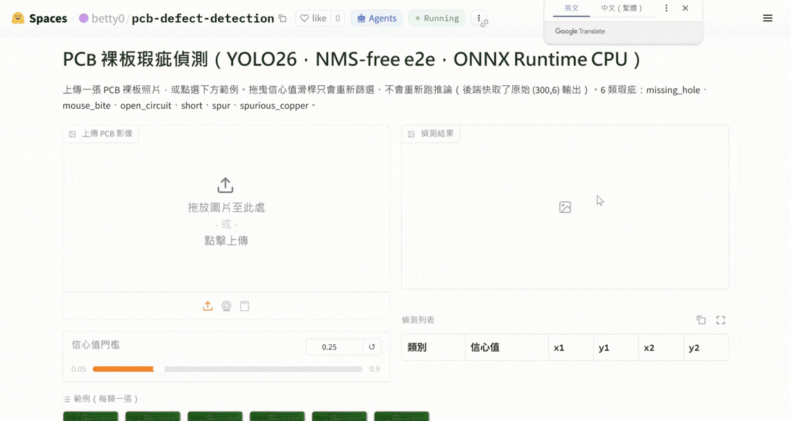
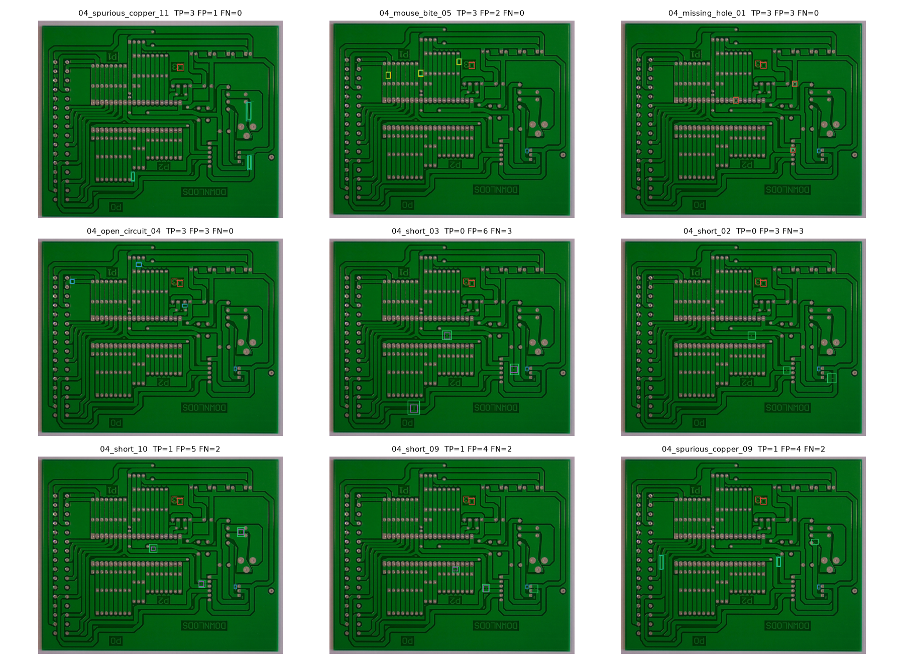
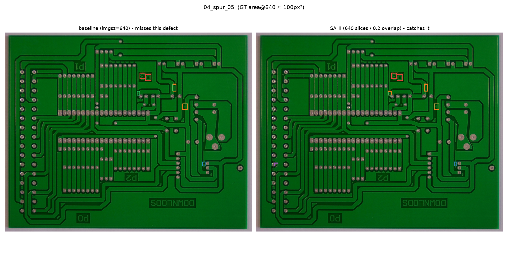

[](https://huggingface.co/spaces/betty0/pcb-defect-detection) [](https://huggingface.co/betty0/pcb-defect-detection) [](https://github.com/tun0000/pcb-defect-detection/blob/main/LICENSE) [](https://www.python.org/) [](https://docs.ultralytics.com/) [](https://github.com/tun0000/pcb-defect-detection/actions/workflows/ci.yml)

# pcb-defect-detection

用 Ultralytics **YOLO26**（NMS-free 端到端偵測頭）偵測 PCB 裸板六類瑕疵（HRIPCB / PKU-Market-PCB 資料集）的求職作品集專案。目標讀者：台灣電子製造／AOI 職缺面試官。

執行藍圖與所有技術決策見 [plan.md](plan.md)（含每個步驟的實測結果與偏離記錄）。



## 六類瑕疵

`missing_hole`（漏鑽孔）、`mouse_bite`（鼠咬）、`open_circuit`（斷路）、`short`（短路）、`spur`（毛刺）、`spurious_copper`（多餘銅）

## 這對 AOI 產線的價值

- **recall ≈ 漏檢率（escape rate）**、**precision ≈ 誤殺率（false kill，決定人工複判成本）**——這個 repo 的每個表格都同時列出兩者，而不是只秀一個好看的 mAP。
- **YOLO26 是 NMS-free 端到端架構**：匯出的 ONNX/TensorRT 圖只需要信心值過濾，不用另外調 NMS 閾值——`app/app.py`（見下方 demo）只用 onnxruntime + opencv 就能跑完整推論管線，沒有 torch/ultralytics。
- **最強的誠實工程賣點**：這份資料集只有 10 片模板裸板，隨機切分會讓同一片板子的背景同時出現在 train/test，讓數字虛高。這個專案刻意訓練了兩個模型（板級分組 vs 隨機切分）來**量化**這個灌水幅度：grouped mAP50=0.8390，random mAP50=0.9603，差距 **12.1 個百分點**——這個差距本身就是最值得跟面試官講的故事。
- **兩個「沒有把工具包裝成萬靈丹」的誠實負結果**：TensorRT INT8 在這個模型上沒有部署理由（比 FP16 慢且精度掉 2 個百分點）；SAHI 切片推論的 recall 增益集中在單一類別、precision 代價卻是全面性的，單純拉高推論解析度更划算。細節見下方 benchmark／SAHI 章節。

## 線上 Demo

[](https://huggingface.co/spaces/betty0/pcb-defect-detection)

零 torch/ultralytics 依賴、純 CPU（`onnxruntime` + `opencv-python-headless`），上傳圖片或點選範例即可看到偵測框；拖曳信心值滑桿只重新篩選已快取的原始輸出，不會重新推論。

## 結果（test split，只用過一次）

板級分組（防洩漏，主要結果）vs 隨機切分（對照，與文獻可比但有板子背景洩漏）。
**兩者的 test set 是不同的圖片**（切分策略不同，測試集內容也不同）——
這不是同一組圖片跑兩個模型，而是「同一套流程在兩種切分假設下各自的誠實結果」。

| 指標 | grouped（主要） | random（對照） | 差距 |
|---|---|---|---|
| mAP50 | 0.8390 | 0.9603 | +0.1213 |
| mAP50-95 | 0.3881 | 0.5082 | +0.1200 |
| test images | 120 | 72 | - |
| test instances | 358 | 284 | - |

### 每類別 AP50

| class | grouped | random | 差距 |
|---|---|---|---|
| missing_hole | 0.9806 | 0.9942 | +0.0136 |
| mouse_bite | 0.9362 | 0.9533 | +0.0171 |
| open_circuit | 0.8963 | 0.9694 | +0.0731 |
| short | 0.5649 | 0.9950 | +0.4301 |
| spur | 0.8632 | 0.8662 | +0.0030 |
| spurious_copper | 0.7929 | 0.9839 | +0.1910 |

隨機切分的 mAP50 比板級分組高 12.1 個百分點——這個差距就是「板子背景洩漏」造成的灌水幅度：隨機切分讓同一片模板板的背景同時出現在train 和 test，模型某種程度上是在「認板子」而不是純粹認瑕疵。grouped 的數字比較低，但也比較誠實，是這個專案實際部署時該參考的數字。



*上圖選圖規則：好的例子取 F1 最高且類別多樣化，壞的例子優先選「有漏檢」（AOI escape）再選「誤殺多」——全部規則寫死、非人工挑選，詳見 `scripts/evaluate.py`。*

## Benchmark

本機 CPU（ONNX Runtime）與 Colab T4 GPU（PyTorch / TensorRT FP16 / TensorRT INT8）五個後端的延遲與精度對照。方法學一致：100 張固定 test 圖、30 次 warmup、循環 2 輪＝200 次計時推論、batch=1、`time.perf_counter` 量端到端（前處理＋推論＋後處理），GPU 端每次呼叫前後都插 `torch.cuda.synchronize()` barrier。詳見 `scripts/benchmark_cpu.py` / `notebooks/benchmark_colab.ipynb`（plan.md SS 2.4）。

| backend | precision | device | p50 (ms) | p95 (ms) | FPS (1/p50) | mAP50-95 |
|---|---|---|---|---|---|---|
| ONNX Runtime | fp32 | CPU（本機，全執行緒） | 81.48 | 86.38 | 12.27 | 0.3867 |
| ONNX Runtime | fp32 | CPU（本機，2-thread，HF proxy） | 141.31 | 153.42 | 7.08 | 0.3867 |
| PyTorch | fp32 | T4 GPU（Colab） | 102.87 | 152.84 | 9.72 | 0.3881 |
| TensorRT | fp16 | T4 GPU（Colab） | 77.71 | 119.78 | 12.87 | 0.3887 |
| TensorRT | int8 | T4 GPU（Colab） | 78.96 | 122.94 | 12.66 | 0.3681 |

### 精度-速度取捨

- **TensorRT FP16 vs PyTorch FP32（T4）**：快 +32.4%，mAP50-95 幾乎不變（+0.0005）—— FP16 在這個模型上幾乎是「免費的加速」。
- **TensorRT INT8 vs PyTorch FP32（T4）**：快 +30.2%，但 mAP50-95 掉了 0.0200（超過 2 個百分點門檻，同 export_models.py）。
- **INT8 vs FP16（T4）**：INT8 並沒有比 FP16 快（-1.6%，在雜訊範圍內，甚至略慢），卻要犧牲更多精度——這個模型/硬體組合下，**INT8 被 FP16 全面壓過，沒有部署理由**。這不是預期中「量化一定更快」的結果，但實測數字就是如此，如實記錄。
- **本機 CPU（全執行緒）vs T4 PyTorch FP32**：本機 CPU 反而快 +26.2%。這不是公平的硬體成本對比（筆電 CPU vs 資料中心 GPU），但對「batch=1 單張推論」這個部署場景來說是真實可信的數字：模型夠小、單張推論的 GPU 呼叫額外開銷（kernel 啟動、PCIe 傳輸）稀釋掉了 GPU 的算力優勢，GPU 的優勢通常要更大 batch 或更大模型才會顯現。這也支持這個專案把 Hugging Face Space 部署在免費 CPU 層的選擇——不只是省錢，這個工作負載形狀下 CPU 本來就是合理選項。

### 誠實聲明

- **本機 CPU**：Intel64 Family 6 Model 154 Stepping 3, GenuineIntel，16 邏輯核心，Windows-11-10.0.26200-SP0（`scripts/benchmark_cpu.py` 實測）。
- **Colab T4**：Colab Pro (T4 runtime)，ultralytics 8.4.89、torch 2.11.0+cu128、TensorRT 11.1.0.106（`notebooks/benchmark_colab.ipynb` 實測）。
- 這些數字**不能**直接拿來跟 Ultralytics 官方發布的 T4 benchmark 數字比較：batch size、TensorRT/驅動版本、量測方式（端到端 vs 純推論）都可能不同。
- 「2-thread proxy」只是粗略模擬 Hugging Face 免費 CPU-Basic 層（2 vCPU），不是在該租戶上實測——真正的 Space 上線後延遲可能不同。
- INT8 的校準資料來自 `data.yaml` 的 train split（`fraction=1.0`，官方預設值），與這裡拿來算 fidelity 的 test split 分開，calibration 沒有碰過 test 資料。
- ONNX（CPU 兩列共用）mAP50=0.8094／PyTorch T4 mAP50=0.8390：兩者本該相同（同一組 `.pt` 權重、同一份 test split），實際些微差異（0.0296）已在 `reports/export_fidelity.json` 記錄並判斷為 FP32 ONNX 匯出的已知數值特性，不是新問題。

## SAHI 切片推論消融實驗

三種推論策略在同一份 test split（120 張圖，全部來自板號 04）上的 recall/precision 對照：baseline（整張圖 imgsz=640）、SAHI（640 切片／0.2 重疊）、hires（整張圖 imgsz=1280，回答「SAHI 的增益是不是只靠解析度」）。詳見 `scripts/sahi_experiment.py`（plan.md SS 2.5）。

### 整體指標

| arm | recall | precision | mean sec/img |
|---|---|---|---|
| baseline (imgsz=640) | 0.7654 | 0.4215 | 0.187 |
| SAHI (640 slices / 0.2 overlap) | 0.7737 | 0.3424 | 4.688 |
| hires (imgsz=1280) | 0.7682 | 0.8540 | 0.417 |

### 每類別 recall

| class | baseline (imgsz=640) | SAHI (640 slices / 0.2 overlap) | hires (imgsz=1280) |
|---|---|---|---|
| missing_hole | 0.9833 | 0.9833 | 1.0000 |
| mouse_bite | 0.9000 | 0.9000 | 0.9333 |
| open_circuit | 0.7288 | 0.7288 | 0.8475 |
| short | 0.6102 | 0.6102 | 0.3729 |
| spur | 0.7500 | 0.8000 | 0.8667 |
| spurious_copper | 0.6167 | 0.6167 | 0.5833 |

### GT 面積三分位分桶 recall（換算至 imgsz=640，桶界線 180px² / 243px²）

COCO 的絕對面積分桶（small/medium/large）對這個資料集無意義——全部瑕疵都遠小於 COCO 的門檻，所以改用資料集自己的相對三分位。

| bucket | baseline (imgsz=640) | SAHI (640 slices / 0.2 overlap) | hires (imgsz=1280) |
|---|---|---|---|
| 小 (bottom third) | 0.8000 | 0.8250 | 0.9250 |
| 中 (middle third) | 0.8487 | 0.8487 | 0.8739 |
| 大 (top third) | 0.6471 | 0.6471 | 0.5042 |

### 分析

- **SAHI 抓到的額外 TP 高度集中在單一類別**：SAHI 比 baseline 多抓到 3 個 GT，全部集中在「spur」（其餘類別 recall 完全沒變），代價是多了 156 個 FP（分散在所有類別）——換算成 AOI 的說法：多背 156 次誤殺（人工複判成本）只換到 3 次少漏檢，這筆帳不划算。
- **hires 在小物件桶的挽回幅度比 SAHI 大，成本卻低很多**：小三分位 recall baseline 0.8000 → hires 0.9250（+0.1250）vs SAHI 0.8250（+0.0250）；hires 只慢 2.2x（SAHI 慢 25.1x），precision 也遠高於 SAHI （0.8540 vs 0.3424）。
- **結論：這個資料集/模型組合下，SAHI 不值得部署**——recall 增益小且集中在少數類別，precision 代價（AOI 誤殺率／人工複判成本）卻是全面性的，跑起來還慢一個數量級；如果目標是挽回小物件 recall，提高推論解析度（hires）是更划算的選擇。
- **一個留意但未深究的反例**：hires 在 short 類別的 recall 反而下降（baseline 0.6102 → hires 0.3729），跟其他類別的走勢相反——可能與 640 訓練／1280 推論的解析度不匹配有關，但這裡沒有進一步驗證，如實記錄，不做未經檢驗的定論。
- **單一板號的限制**：這份 test split 全部來自板號 04（板級分組切分的既定結果），所以「每板秒數」等同「每張圖秒數」，沒有另外做逐板拆解的意義；上表的 mean sec/img 已經是這批圖唯一有意義的時間單位。

### 對照圖

`assets/figures/sahi_comparison.png` — 04_spur_05：baseline 漏掉的一個瑕疵（GT area@640 ≈ 100px²，三分位裡最小的一批），SAHI 抓到了。挑選規則：所有「baseline 漏、SAHI 抓到」的候選中，取 GT 面積最小的一個（決定性選圖，不是挑最好看的）。



## 重現步驟

```bash
# 0. 安裝 uv，並同步基礎環境（資料前處理＋測試，零 torch）
uv sync

# 1. 下載＋轉換資料（一次性 ~2GB 下載；kagglehub 快取共用）
uv run python -m pcb_defect.data_prep.prepare --out data/pcb --strategy grouped --seed 42
uv run python -m pcb_defect.data_prep.prepare --out data/pcb_random --strategy random --seed 42

# 2. EDA
uv run python -m pcb_defect.stats --data data/pcb --out reports

# 3. （選用）本機 smoke test，需要 GPU 或 --allow-cpu
uv sync --extra train
uv run --extra train python -m pcb_defect.smoke --data data/pcb/data.yaml --allow-cpu

# 4. 訓練：在 Colab 依序跑兩次 notebooks/train_colab.ipynb
#    （SPLIT_STRATEGY="grouped" 再改成 "random"），下載 best.pt 放進
#    weights/grouped/ 與 weights/random/

# 5. Phase 2：評估／匯出／parity gate／SAHI（依序）
uv run --extra train python scripts/evaluate.py
uv sync --extra train --group eval
uv run --extra train --group eval python scripts/export_models.py
uv run --extra train --group eval python scripts/verify_onnx_parity.py
uv sync --extra train --group sahi
uv run --extra train --group sahi python scripts/sahi_experiment.py --smoke  # 先跑 smoke
uv run --extra train --group sahi python scripts/sahi_experiment.py

# 6. Benchmark：本機 CPU ＋ Colab T4（notebooks/benchmark_colab.ipynb），再組表
uv run --extra train --group eval python scripts/benchmark_cpu.py
#    （Colab 跑完 notebooks/benchmark_colab.ipynb 後把印出的 JSON 存成
#    reports/benchmark_gpu.json）
uv run python scripts/render_benchmark_report.py

# 7. 上傳 HF（需要 .env 裡的 HF_TOKEN）
uv sync --group hf
uv run --group hf python scripts/upload_hf.py
uv run --group hf python scripts/deploy_space.py
```

## 限制與誠實聲明

- **只有 10 片模板裸板**：板級分組切分的 val/test 各只有 1 片板，per-board 的視覺變異會讓數字比板子數量更多的資料集更晃動；這也是選擇同時跑隨機切分對照組的原因之一。
- **合成瑕疵，非真實產線缺陷**：HRIPCB 的瑕疵是人工引入的（非真實 AOI 產線良率問題），真實產線影像的光照、對焦、背景可能造成明顯的 domain shift，部署前應該用目標產線影像重新驗證。
- **板級分組數字不能跟用隨機切分的論文/notebook 直接比較**：本專案的 grouped 數字刻意偏保守，見上方洩漏對照表。
- **`short`／`spurious_copper` 是最弱的兩類**：在 evaluate.py 與 SAHI baseline 兩個獨立測量中都重複出現，是真實、可重現的現象，不是量測雜訊。
- **資料集授權**：Kaggle 鏡像（`akhatova/pcb-defects`）標示授權「Unknown」，請引用原始論文（見下方引用）。
- **AGPL-3.0 商用限制**：本 repo 與 HF 權重皆為 AGPL-3.0（因使用 Ultralytics YOLO26），商用需要[Ultralytics Enterprise License](https://www.ultralytics.com/license)。

## 引用

```
Huang, W., & Wei, P. (2019). A PCB Dataset for Defects Detection and
Classification. arXiv:1901.08204. https://arxiv.org/abs/1901.08204
```

資料集：[Kaggle: akhatova/pcb-defects](https://www.kaggle.com/datasets/akhatova/pcb-defects)　模型：[Ultralytics YOLO26](https://docs.ultralytics.com/)

## 授權

本專案使用 Ultralytics YOLO26，整個 repo（含微調權重）以 **AGPL-3.0** 授權釋出。

---

## TL;DR (English)

PCB bare-board defect detector (6 classes, HRIPCB dataset) built with Ultralytics **YOLO26**
(NMS-free end-to-end head). The headline engineering story: a board-grouped train/val/test split
(no board's background leaks between splits) scores mAP50=0.8390 versus
mAP50=0.9603 for an otherwise-identical random split - a 12.1-point gap
that is pure background leakage, quantified rather than glossed over. Two honest negative results
are documented rather than hidden: TensorRT INT8 isn't worth deploying here (no speed edge over
FP16, costs 2 points of mAP50-95), and SAHI slicing barely helps recall (gain concentrated in one
class) while inflating false positives - plain higher-resolution inference is the better lever for
small-object recall on this dataset. Live demo, model weights, full benchmark/ablation reports, and
every script that produced every number in this README are linked above.
